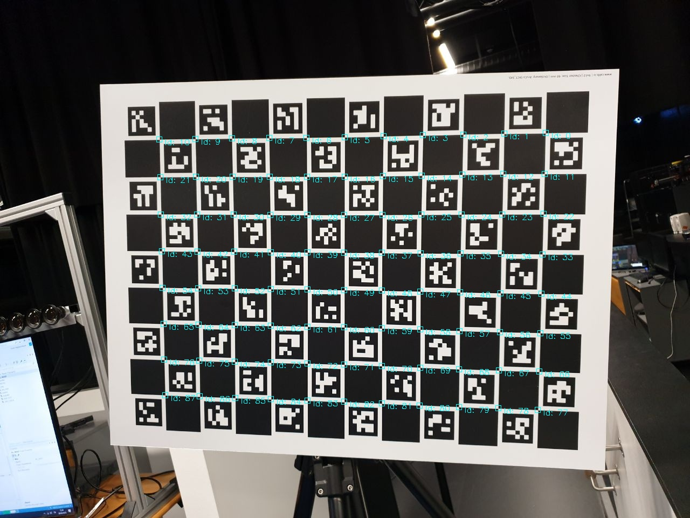

# ChArUco Corner Detection with OpenCV

## 1 Introduction

[Thesis](http://urn.fi/URN:NBN:fi:tty-201905101555)

Python OpenCV corner detection to detect [ChArUco](https://docs.opencv.org/3.2.0/df/d4a/tutorial_charuco_detection.html) markers and corners. This project has also support for calling the corner detection through Matlab. This code detects markers (QR-codes) in the ChArUco board and interpolates the corners between 2 found markers. Corner IDs and coordinates are obtained in this project. Scripts also provide real-time and still image visualization, and detection rate for set of images.

These scripts have been done in purpose of camera calibration so the goal was to find and identify corner coordinates. Expected outputs from the scipts are corner coordinates (x,y) in pixels and their corresponding IDs (from 0 to N-1).




## 2 Dependencies

These scripts have been tested in Manjaro 18.0.4 and in Windows 10. In order to run Python scripts through Matlab, you must have Python 3.6 installed. If Matlab support is not needed, the Python scripts should work with Python 3.7 as well. All the scripts use OpenCV contrib modules which must be installed, see ```requirements.txt```.

## 3 Installation

1. Install Python 3.6

2. Clone the repository

```
git clone https://github.com/pettod/charuco-corner-detection.git
```

3. Install Python dependencies

```
cd charuco-corner-detection
pip install -r requirements.txt
```

In case of having version issues with the libraries, at least these versions have been tested to work:
- Python 3.6.1
- numpy 1.16.4
- opencv 4.1.0
- scipy 1.3.0

## 4 Usage

### 4.1 Setting Correct ChArUco Parameters

Python scripts have a few certain constant values that define the parameters needed to detect the markers in the given ChArUco calibration board. The table below describes the used parameters that must be defined. The main parameters are the first 3 ones which determine the number of corners and a marker resolution in the ChArUco calibration board.

| Parameter      | Description   |
| -------------- | ------------- |
| CORNERS_X      | The number of checkerboard corners in x direction |
| CORNERS_Y      | The number of checkerboard corners in y direction |
| MARKER_DICT    | Marker dictionary, depends on the marker resolution and the maximum number of needed marker IDs |
| SQUARE_LENGTH  | The side length of a square in a checkerboard pattern in millimeters |
| MARKER_LENGTH  | The side length of a marker in a checkerboard pattern in millimeters |

Note: Parameters CORNERS_X and CORNERS_Y must be given in correct order meaning that if some weird values are found for corner coordinates, you will have to swap the values between these parameters. The weird values can be noticed by visualizing the corner coordinates. MARKER_DICT values can be found from OpenCV's documentation under [cv::aruco::PREDEFINED_DICTIONARY_NAME](https://docs.opencv.org/4.1.0/d9/d6a/group__aruco.html#gac84398a9ed9dd01306592dd616c2c975), but the common possible enumerators and their integer values are also covered in the table below.

| Enumerator            | Value     |
| --------------------- | --------- |
| DICT_4X4_50    	    | 0         |
| DICT_4X4_100   	    | 1         |
| DICT_4X4_250   	    | 2         |
| DICT_4X4_1000  	    | 3         |
| DICT_5X5_50    	    | 4         |
| DICT_5X5_100   	    | 5         |
| DICT_5X5_250   	    | 6         |
| DICT_5X5_1000  	    | 7         |
| DICT_6X6_50    	    | 8         |
| DICT_6X6_100   	    | 9         |
| DICT_6X6_250   	    | 10        |
| DICT_6X6_1000  	    | 11        |
| DICT_7X7_50    	    | 12        |
| DICT_7X7_100   	    | 13        |
| DICT_7X7_250   	    | 14        |
| DICT_7X7_1000         | 15        |

The name of an enumerator defines the marker resolution and the maximum number of used corners in the dictionary. The maximum number of corners in the dictionary must always be greater or equal than the number of corners in the ChArUco calibration board that is currently in use.

### 4.2 Running the Code

Explanations for the scripts in the repository are described here.

#### Note: You must set correct parameters depending on your ChArUco calibration board before running the scripts. 

#### 4.2.1 Python

1. ```draw_still_image_corners.py```

Visualizes detected ChArUco corners. The resulting image should be similar with the still image above where squares are drawn to the corners with corner ID. Run the script as follows:

```
python draw_still_image_corners.py path/to/image.jpg
```

where the argument is path to the still image.

2. ```image_set_detection_rate.py```

Computing the detection rate for a set of images is informative, and helps to see fast how good images were taken during the capturing process. The command line interface is similar to the still image case. The path to the image set or multiple paths of the image sets can be given as arguments for the code. The call is as follows:

```
python image_set_detection_rate.py path/*.jpg another/path/*.jpg
```

It prints information of how many images had at least 1 detected corner and the percentage of detected corners compared to maximum number of corners (which is the number of images multiplied by the number of corners in the ChArUco calibration board). 

3. ```real_time_corner_detection.py```

Runs real-time ChArUco marker and corner detection. It helps during the capturing session to see in real-time how well the markers are detected with different distances and angles in relation to a camera. Run the code as follows:

```
python real_time_corner_detection.py
```

Note: 6X6 ChArUco board is provided in the ```test_images/charuco_marker_6x6.png``` file. The board can be printed to a paper and tested out.

4. ```write_corners_to_mat.py```

Writes ChArUco calibration board's corner coordinates and IDs to ```.mat``` file. Multiple file formats or paths can be given as arguments. Run the code as follows:

```
python write_corners_to_mat.py path/*.jpg another/path/*.jpg
```

Note: It was noticed that Matlab (version R2018b) does not support
the NumPy library in Python 3.7. In Matlab, the image coordinates are then read from the ```.mat``` file.

#### 4.2.2 Matlab

1. ```matlab_read_corners_example.m```

Example file on how to read the ChArUco corner coordinates and IDs from the written ```.mat``` file. Needs to know the written corner coordinates and IDs file names, maximum number of corners in the ChArUco calibration board and the number of written images. Uses file ```read_corners_from_mat.m``` for reading.

2. ```matlab_charuco_example.m```

Example file on how to use the ChArUco corner detection API through Matlab. This is the file for Matlab users who want directly detect ChArUco calibration board's corners with corner IDs by using only Matlab. If ChArUco corner detection is needed in your project, you will have to copy files ```charuco.py``` and ```detect_charuco_corners.m``` to your project folder.
